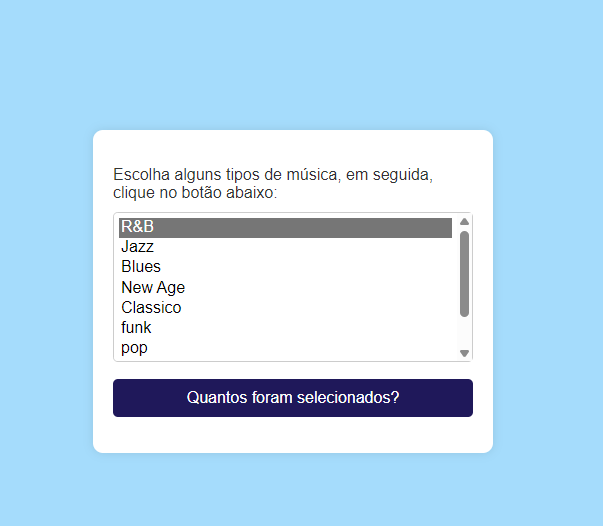

# Formulário de Musica📄
 
Este é um simples formulário de login que fizemos ano passando e estamos melhorando ele e foi usado o HTML, CSS e JavaScript utilizando o framework Bootstrap 5.

## Funcionalidades⚙️
 
- mostrar quantos estilos musicais você selecionou
- mostra alguns estilos de musica 

## Como Utilizar📌
 
1. Faça o download dos arquivos HTML e CSS.
2. Abra o arquivo HTML em um navegador da web compatível.
3. selecione algum estilo musical.
4. Clique no botão "Quantos foram selecionados" para mostrar a notificação.
 
## Tecnologias Utilizadas💻
 
- HTML
- CSS
- Bootstrap 5
 
## Estrutura de Arquivos📁
 
- `login.html`: Contém a estrutura do formulário de musica.
- `login.css`: Arquivo de estilo para personalizar a aparência do formulário.
  
## Autores 📍
[Liara Silva](https://github.com/LiaraSilva?tab=repositories)